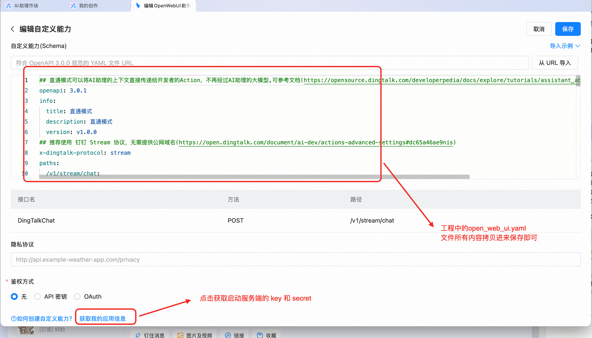
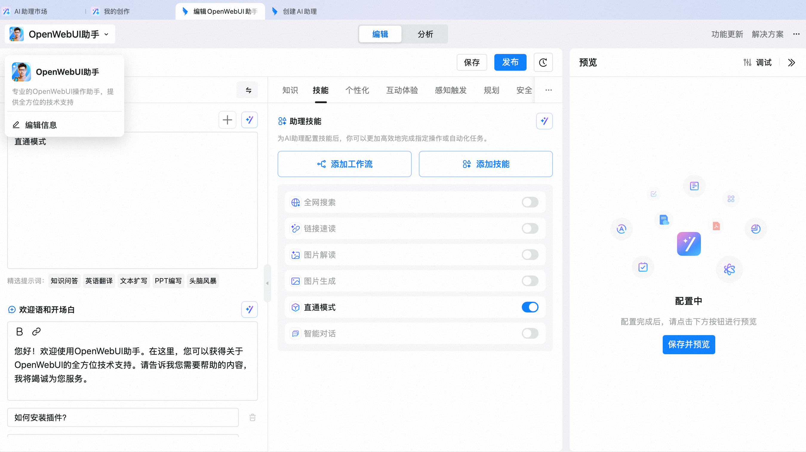
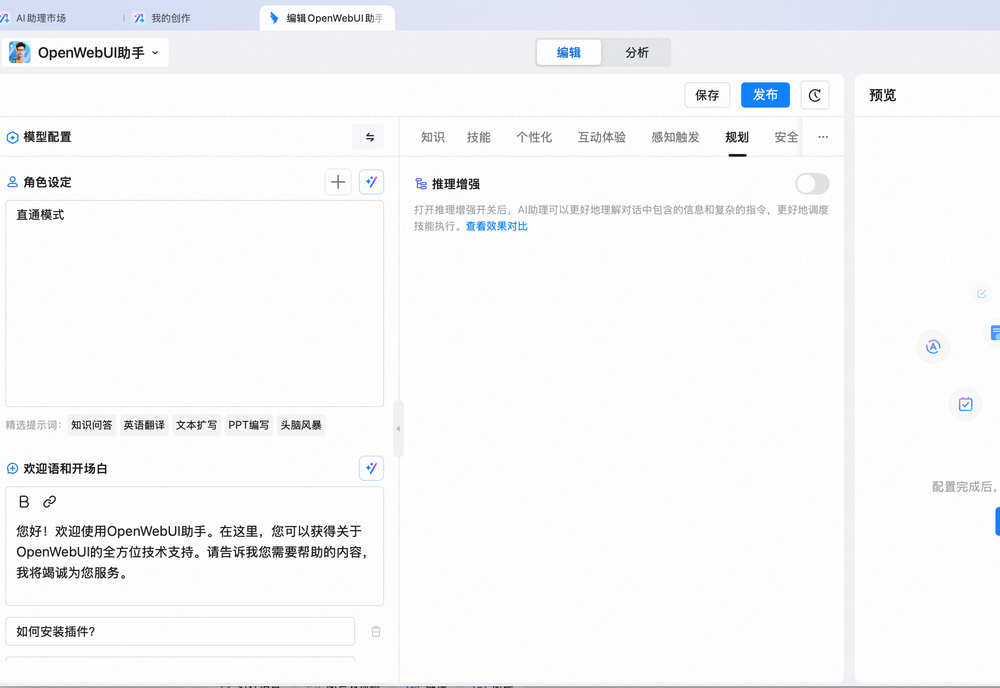
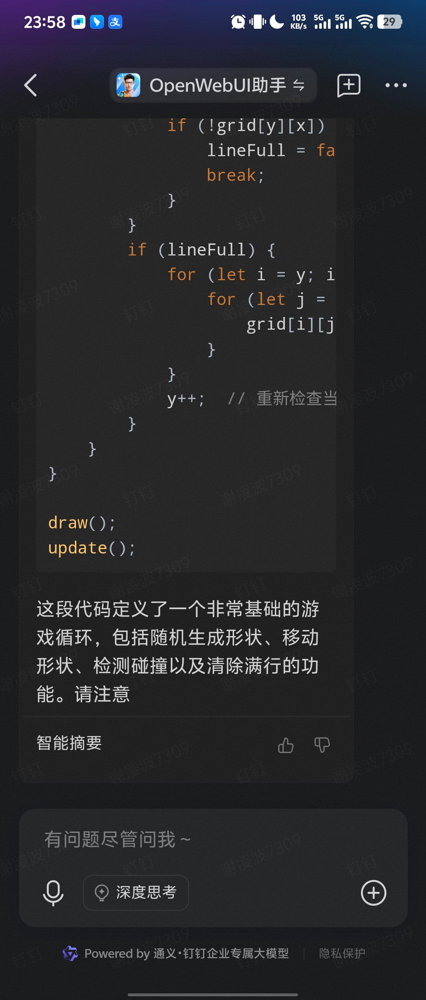
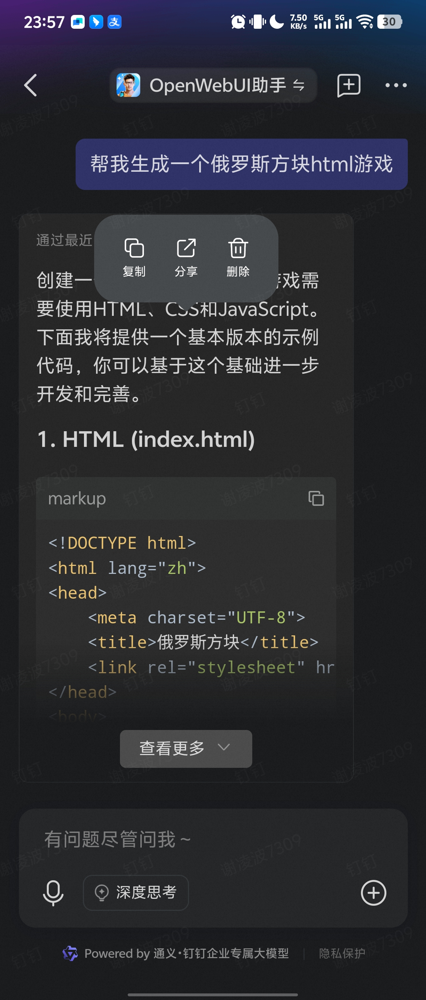

# dingtalk-open-web-ui
OpenWebUI通过OpenAPI方式支持MCP后，有多强大就不用多说了。
本项目可快速连接钉钉助理到 OpenWebUI，可实现OpenWebUI消息直接推送到钉钉，目前只开发了文本和markdown卡片。
## 安装
``` shell
    pip install uv
    uv sync
```
## 配置
```
    copy config.example.py config.py
```
* 修改config.py中openwebui的url和apikey(在openwebui账户中获取)
* 修改dingtalk的key和secret(在钉钉助理的自定义技能页面最底下的超链接点击获得)


## 钉钉卡片创建
    https://open-dev.dingtalk.com/fe/card
* 创建时候使用最基础的markdown模板即可，然后点击右上角的保存、发布
* 返回到卡片列表拷贝卡片模板ID, 加入到config.py

## 运行服务端
``` shell
 uv run main.py
```
## 配置钉钉助理
* 在助理市场新建一个助理，按下图配置


* 新增一个自定义技能，下面内容拷贝进去即可，其他技能全部关闭！！！
``` yaml
## 直通模式可以将AI助理的上下文直接传递给开发者的Action，不再经过AI助理的大模型,可参考文档(https://opensource.dingtalk.com/developerpedia/docs/explore/tutorials/assistant_ability/passthrough_mode/java/intro)
openapi: 3.0.1
info:
  title: 直通模式
  description: 直通模式
  version: v1.0.0
## 推荐使用 钉钉 Stream 协议，无需提供公网域名(https://open.dingtalk.com/document/ai-dev/actions-advanced-settings#dc65a46ae9nis)
x-dingtalk-protocol: stream
paths:
  /v1/stream/chat:
    post:
      description: 调用OpenWebUI
      summary: 调用OpenWebUI
      operationId: OpenWebUI
      x-dingtalk-params-confirm: false
      x-dingtalk-display-result: disabled
      requestBody:
        content:
          application/json:
            schema:
              $ref: '#/components/schemas/GraphRequest'
      responses:
        '200':
          description: OK
          content:
            application/json:
              schema:
                $ref: '#/components/schemas/GraphResponse'
components:
  schemas:
    GraphRequest:
      type: object
      properties:
        userId:
          type: string
          description: userId
          x-dingtalk-context:
            property: currentUser
            format: userId
        unionId:
          type: string
          description: unionId
          x-dingtalk-context:
            property: currentUser
            format: unionId
        jobNum:
          type: string
          description: jobNum
          x-dingtalk-context:
            property: currentUser
            format: jobNum
        corpId:
          type: string
          description: corpId
          x-dingtalk-context:
            property: currentOrg
            format: corpId
        rawInput:
          type: string
          description: rawInput
          x-dingtalk-context:
            property: currentInput
            format: raw
        inputAttribute:
          type: string
          description: inputAttribute
          x-dingtalk-context:
            property: currentInput
            format: attribute
        openConversationId:
          type: string
          description: openConversationId
          x-dingtalk-context:
            property: currentConversation
            format: openConversationId
        conversationToken:
          type: string
          description: conversationToken
          x-dingtalk-context:
            property: currentConversation
            format: conversationToken
        sessionWebhook:
          type: string
          description: sessionWebhook
          x-dingtalk-context:
            property: currentConversation
            format: sessionWebhook
    GraphResponse:
      type: object
```

## 开始体验吧
支持流式


